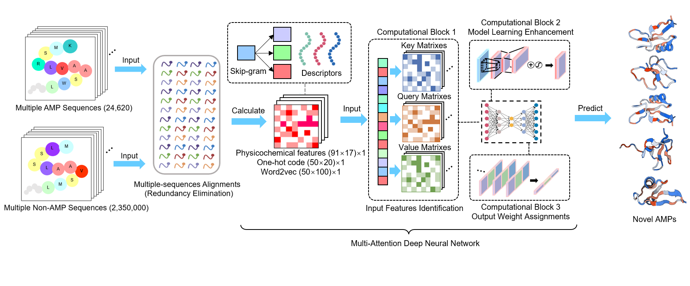
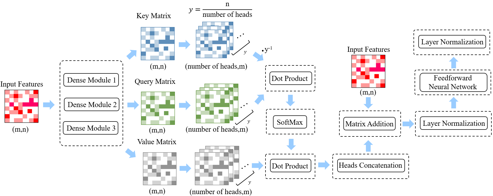
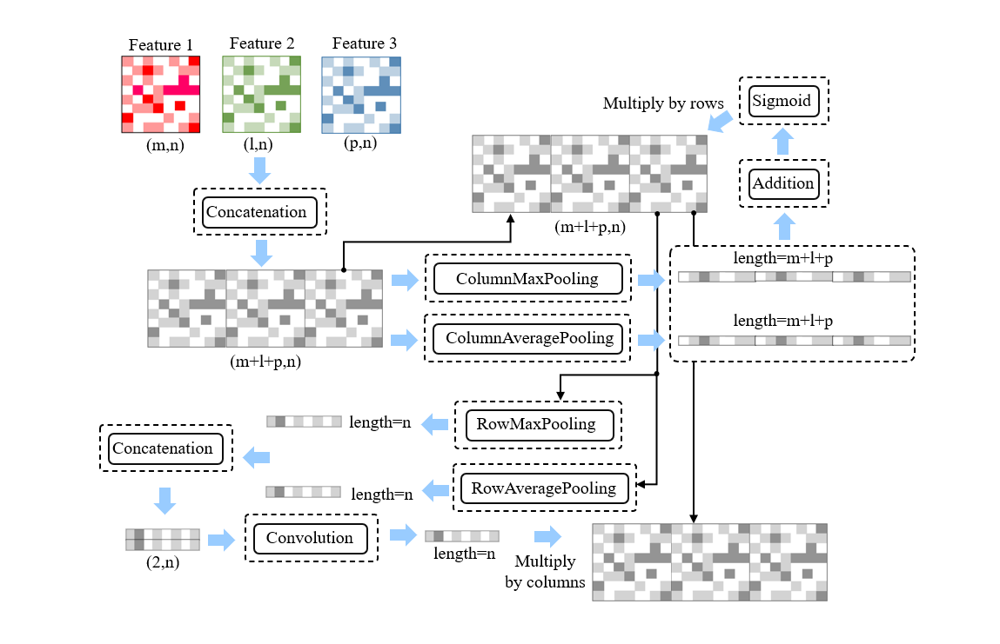

### Brief Introduction of Developers
#### Developer Introduction

**Sizhe Chen**, PhD Student (Medical Sciences) at Chinese University of Hong Kong (1155202847@link.cuhk.edu.hk). Supervisor: **Professor CHAN Ka Leung Francis**，**Professor Siew N.G.**, and **Research Assistant Professor Qi Su**. Welcome to contact **Sizhe Chen** via the aforementioned email if you have any questions or suggestions.

This work is supervised by **Professor Siew N.G.**, **Professor Yang Sun**, and **Research Assistant Professor Qi Su**. The research work is primarily finished by **Sizhe Chen** (PhD student), and **Zhilu Xu** (Research Assistant Professor) with equal contributions.

# AMPidentifier-2.0
This is an updated version of AMPidentifier 1.0 (https://github.com/ChenSizhe13893461199/Fast-AMPs-Discovery-Projects), with a rapid training rate on consumer-grade laptops and overall high performances.

For more details on AMPidentifier 1.0, please refer to our previously published article: 

[1] **Sizhe Chen#**, Huitang Qi#, Xingzhuo Zhu#, Tianxiang Liu, Yutin Fan, Qi Su, Qiuyu Gong*, Cangzhi Jia*, Tian Liu*. Screening and identification of antimicrobial peptides from the gut microbiome of cockroach _Blattella germanica_. **_Microbiome_** 2024, 12: 272. IF=16.837 doi: **10.1186/s40168-024-01985-9**.

### The framework of AMPidentifier 2.0:

The source codes of the AMPidentifier 2.0 are available here, with an average **AUPRC indicator of 0.9486±0.0003** and a significantly reduced training time of **3200±53s** on the normal laptop (Intel i7-10875H CPU). Compared to the previous model AMPidentifier 1.0 (**AUPRC: 0.9495±0.0022**, **training time: 15,374±169s**), with overall fitting parameters and time costs decreased by approximately 56% and 80%, respectively. With the introduction of three computational modules, it still showed high overall prediction performance and low false-positive conditions (**Specificity: 90.1347±0.9487%**, **Sensitivity: 99.6864±0.046%**).

### Details of Using AMPidentifier 2.0
### Requirements
- python 3.9.7 or higher
- keras==2.10.0
- pandas==1.5.2
- matplotlib==3.0.3
- propy3 (tutorial: https://propy3.readthedocs.io/en/latest/UserGuide.html)
- numpy==1.23.5
- sklearn=1.2.0
- propy3=1.1.0
- gensim=4.2.0 or 4.3.0
- scipy=1.9.3
- tensorflow=2.10.0

**1.** The deployment codes can be found in "Train_AMP_identifier2.py", with full details and annotations attached. Firstly, open "Train_AMP_identifier2.py" on your laptop (e.g. by Spyder) and introduce all the necessary packages aforementioned.

**2.** Prepare the necessary dataset (training dataset, validation dataset, and test dataset), and their descriptors. For more details, please refer to the section of **Implementation details** below.

**3.** Following the codes provided in "Train_AMP_identifier2.py" and running it in your local Spyder or other suitable environment directly, the training of AMPidentifier 2.0 will be smoothly performed.

## Implementation details:

1. The training sequences were deposited in the document TrainingAMP.csv
2. The validation sequences were deposited in the document Validation.csv
3. The test sequences were deposited in the document Non-AMPsfilter.csv

This algorithm demands one-hot code matrix (sequential information，50×20), word2vec matrix (50×20) and physical/chemical descriptors matrix (91×17) as input.
The one-hot code, Word2Vec, and physicochemical matrix can be calculated by well-annotated codes (line 64-187) in "Train_AMP_identifier2.py" via using the three .csv documents aforementioned. In addition, several necessary files containing pre-calculated physicochemical matrix and Word2Vec parametric file have been well prepared for user convenience, and users don't have to recalculate them again. They can be freely downloaded at https://pan.baidu.com/s/1pC5JM8GkOSNr36CbwGv3zg with password: 1166.

Or you can contact author **Sizhe Chen** for these documents if any problems occur during the downloading. Furthermore, the python codes for generating these files can also be found in "Train_AMP_identifier2.py", with full details discussed in our manuscript. We sincerely welcome any email consultation regarding our model, and we would like to provide technical support when necessary (e.g. model deployment, parameters fine-tuning, etc.).

**Notes:**

Some old laptops may struggle to operate AMPidentifier 2.0 because of memory limitations (Intel i7-10875H CPU or better processor is recommended). In addition, you can also copy the codes and run AMPidentifier 2.0 on the Jupyter viewer deployed on the high-performance server (e.g. CPU: Xeon(R) Gold 6430, GPU: RTX 4090, RAM: 120GB).

We are preparing a detailed tutorial for both AMPidentifier 1.0 and AMPidentifier 2.0 (will be available soon). Please don't hesitate to contact us if you have any suggestions. Thank you for your attention.

The model core file is also being prepared and will be uploaded to GitHub soon

**Mathematical Details**

AMPidentifier 2.0 is a deep-learning neural network framework integrated with 3 unique computational blocks.

The framework of the computational block 1 is shown below:

The computational block 1 was architected following the fundamental paradigm of multi-head attention mechanisms. We hypothesized that this architecture retained feature recognition capabilities despite reducing computationally intensive convolutional kernels, achieving dual objectives of parameter efficiency and pattern discernment in peptide sequences.

The mathematical principles of the computational block 2 have been illustrated in our previous work [1], with details shown below:

The computational block 2 was previously demonstrated to possess performance comparable to that of a nine-layer neural network block, showing improvement to overall model performances.

The framework of the computational block 3 is shown below:

The computational block 3, a novel computational module, was mathematically designed in the framework; It dynamically refines informative features while suppressing less useful noises.

Finally, by integration of all 3 computational blocks, our framework was deployed on a consumer-grade laptop (Intel i7-10875H CPU) and achieved high computational efficiency and the maintenance of predictive performance. AMPidentifier 2.0 (Model G) demonstrated remarkable performances (AUPRC: 0.9486±0.0003) parallel to AMPidentifier 1.0, and 80% reduction in training time costs (3200±53 seconds)
