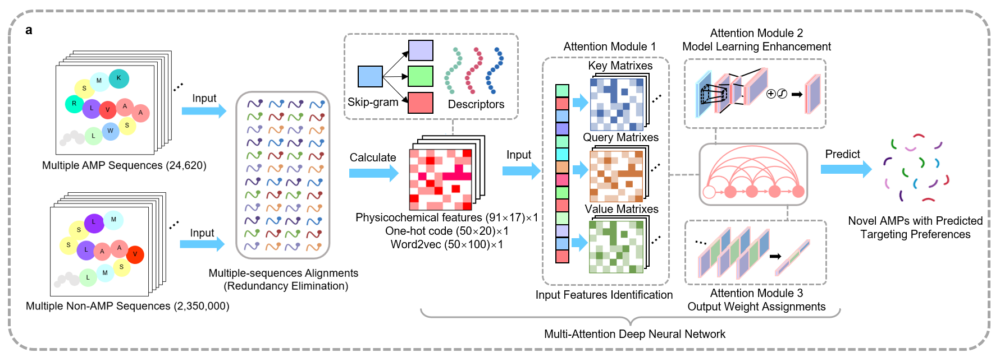

# AMPidentifier-2.0
This is an enhanced version of AMPidentifier 1.0, with a rapid training rate on a normal laptop and high overall performance

The source codes of the new deep learning tool have been finished, with a high AUPRC indicator of 0.9486±0.0003 and a significantly reduced training time of 3200±53 s on the normal laptop. Compared to the previous model AMPidentifier 1.0 (AUPRC: 0.9495±0.0022, Specificity: 86.2963±0.0169 %, Sensitivity: 99.8380±0.0002 %) deposited in Git-hub (https://github.com/ChenSizhe13893461199/Fast-AMPs-Discovery-Projects), it applied a reduction of 50% of the initial model layers. However, with the introduction of three attention modules, it still showed high overall prediction performance and low false-positive conditions (AUPRC: 0.9486±0.0003, Specificity: 90.1347±0.9487 %, Sensitivity: 99.6864±0.046 %). This new model significantly decreased model fitting parameters scales by approximately 60% and decreased training time by approximately 80%.

The framework of AMPidentifier 2.0 is summarized below:

